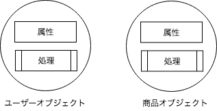
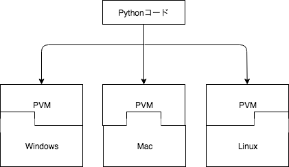

# 1章 Python概要
この章ではPythonの概要について学習します。

## Pythonとは
Pythonとは、オランダ人のグイド・ヴァンロッサムによって開発されたオープンソースのオブジェクト指向スクリプト言語です。

## Pythonの特徴
Pythonには一般的に以下の特徴があります。

1. オブジェクト指向
2. インタプリタ
3. マルチプラットフォーム
4. シンプルな構文

### 1.オブジェクト指向
オブジェクトとは、世の中に存在するモノ、コトを表し、属性（データ）と処理を持ちます。属性や処理をオブジェクトとしてまとめて扱うことで**可読性**や**拡張性**などを高めることができます。  



### 2.インタプリタ
プログラムは人間がコンピュータに出す命令なので人間の言葉で記述されますが、コンピュータは人間の言葉を読み取れません。そのため、機械語と呼ばれるコンピュータが読み取れる言語に翻訳する必要があります。

**[コンパイラ型言語の場合]**  
C言語などのコンパイラ型言語はプログラムをコンパイルという作業を通して機械語に翻訳します。以下の内容で'hello.c'というファイルを作成します。  

```c
#include "stdio.h"

int main(int argc, char const *argv[]) {
  printf("Hello World!");
  return 0;
}
```

プログラミング後、コンパイルを行います。

```
% gcc -o hello hello.c
```

コンパイルして作成された機械語のファイルを指定して実行します。

```
% ./hello
  Hello World!
```

**[インタプリタ型言語の場合]**  
インタプリタ型は実行しながら1行ずつ翻訳します。以下の内容で`hello.py`というファイルを作成します。

```python
print("Hello World!")
```

プログラミング後、すぐに実行することができます。

```
python hello.py
Hello World!
```

このようにインタプリタ型の言語ではプログラミング後、簡単に実行することができます。簡単に実行できる反面、文法的なエラーなどがあった場合に、実行するまでわからないなどの欠点があります。

<div style="page-break-before:always"></div>

### 3.マルチプラットフォーム
機械語はプラットフォームによって異なります。そのため、機械語に翻訳すると言ってもそれぞれの環境に合わせて翻訳する必要があります。Pythonでは**PVM**（Python Virtual Maichine）と呼ばれる仮想マシンを用いて、各プラットフォームの差を埋めています。  



これにより、プラットフォームの違いを意識せずにPythonを扱うことができるようになっています。

### 4.シンプルな構文
Pythonの構文は非常にシンプルな構成となっております。Javaと比較してみましょう。

**[Javaの場合]**

```java
public class Sample {
  public static void main(String[] args) {

    int age = 20;

    if(age < 20) {
      System.out.println("You are not adult");
    } else {
      System.out.println("You are adult");
    }
  }
}
```

**[Pythonの場合]**

```python
age = 20

if(age < 20):
    print("You are not adult")
else:
    print("You are adult")
```

見比べるとPythonの構文には以下の特徴があることがわかると思います。

- コードブロックは`{}`ではなく、インデントで指定する
- セミコロンが不要（記述してもOK）
- 変数の型を指定しない

このようにPythonはシンプルに記述でき、シンプルに実行できることが特徴といえるでしょう。
