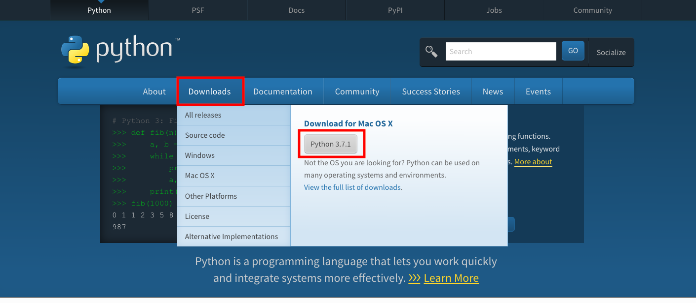
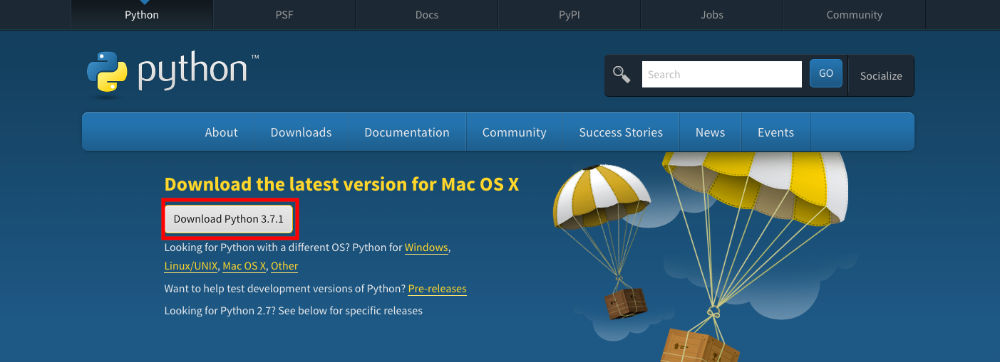
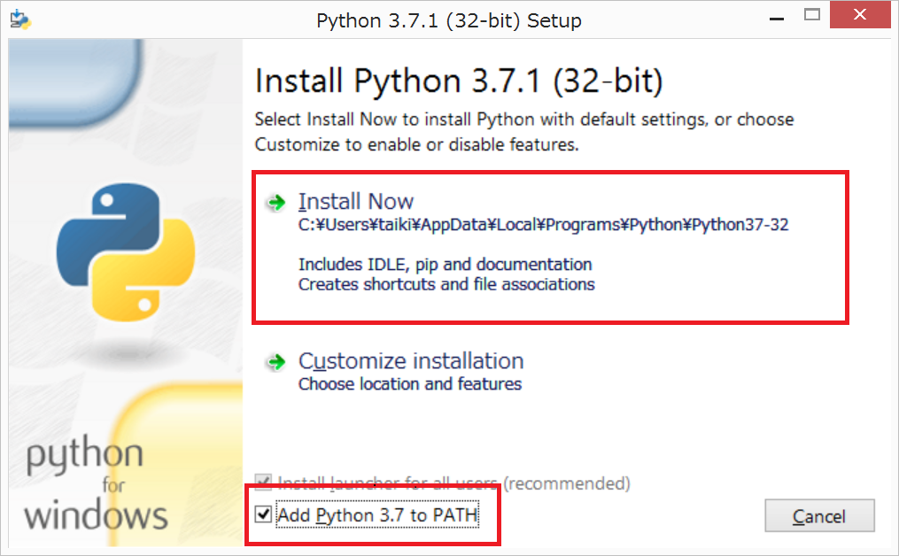
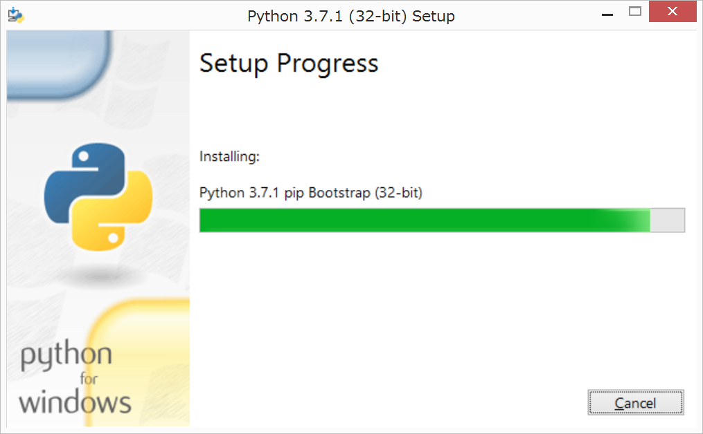
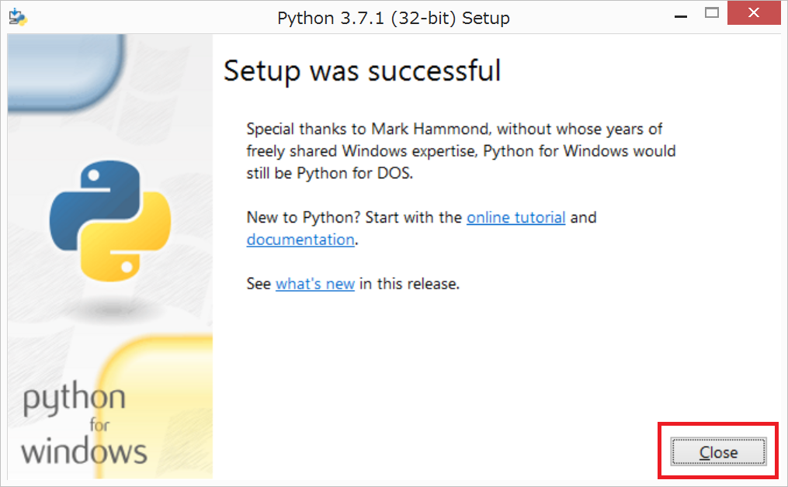

# 2章 Pythonの環境構築
この章ではPythonの環境構築について学習します。  

## Pythonのインストール
Pythonの公式サイトにアクセスします。  
https://www.python.org/

公式サイトにアクセスすると、次のような画面が表示されます。メニューの[Downloads]をクリックすると、最新版のPythonが表示されるのでクリックします。  



ダウンロードリンクが表示されるので、クリックしてダウンロードします。ここでは3.7をインストールしましょう。  



ダウンロードしたファイルを実行すると、インストーラが起動します。[Add Python 3.7 to PATH]にチェックをいれ、[Install Now]をクリックします。  



インストールが開始されるので、しばらく待ちます。  



正常に終了したらCloseボタンをクリックして、インストーラを終了させます。  



インストールが完了したら以下のコマンドを実行し、Pythonがインストールされたことを確認しましょう。

```
% python --version
Python 3.7.1
```

これでPythonのインストールが完了しました。


<div style="page-break-before:always"></div>


## Pythonの起動
Pythonを実行するにはまず、ソースコードを作成する必要があります。`hello.py`というファイル名で、以下の内容を保存してください。

```python
print("Hello World!")
```

作成したソースコードは`python ソースコードのパス`で実行することができます。

```
% python sources/02/hello.py
Hello World!
```
> print関数は、引数に渡された値を画面に出力します。

## Pythonインタプリタ
Pythonを実行するには、上記の方法の他にインタプリタ（REPL）を起動する方法があります。REPLとはRead-eval-print loopの略で、プログラムを読んで、評価して、出力するを繰り返すことを意味します。`python`コマンドで起動します。

```python
% python
Python 3.7.1 (default, Nov 27 2018, 17:00:53)
[Clang 10.0.0 (clang-1000.10.44.4)] on darwin
Type "help", "copyright", "credits" or "license" for more information.
>>> print("Hello World!")
Hello World!
```
Pythonの動きを確認したい時などに重宝します。

<div style="page-break-before:always"></div>

## （補講）IPython
IPythonとは、デフォルトのPythonインタプリタを拡張したものです。pipというPyhtonのパッケージマネージャを使用します。

```
% pip install ipython
```
インストールが完了したら、`ipython`コマンドで起動します。

```python
% ipython
Python 3.7.1 (default, Nov 27 2018, 17:00:53)
Type 'copyright', 'credits' or 'license' for more information
IPython 7.1.1 -- An enhanced Interactive Python. Type '?' for help.

In [1]: print("Hello World!")
Hello World!
```

IPythonにはデフォルトのPythonインタプリタには無い便利な機能がありますので、いくつか紹介します。
- 補完機能
- イントロスペクション
- OSコマンド実行

### 補完機能
IPythonには入力補完機能があります。以下のように`pr`まで入力し、Tabキーを押下してください。

```python
In [2]: pr
```

候補がいくつか表示されます。さらにTabキーを押下して、`print`にフォーカスがあたったら、Enterキーで選択します。万一、キーワードや関数名を忘れてしまっても安心です。また、関数名が長い場合などは入力補助にも使用することができます。

### イントロスペクション
イントロスペクションは変数や関数の情報を出力させることができます。関数名や変数名の後に`?`を入力して実行します。

```python
In [2]: print?
Docstring:
print(value, ..., sep=' ', end='\n', file=sys.stdout, flush=False)

Prints the values to a stream, or to sys.stdout by default.
Optional keyword arguments:
file:  a file-like object (stream); defaults to the current sys.stdout.
sep:   string inserted between values, default a space.
end:   string appended after the last value, default a newline.
flush: whether to forcibly flush the stream.
Type:      builtin_function_or_method
```

変数の情報も確認してみましょう。

```python
In [4]: message?
Type:        str
String form: Hello World!
Length:      12
Docstring:
str(object='') -> str
str(bytes_or_buffer[, encoding[, errors]]) -> str

Create a new string object from the given object. If encoding or
errors is specified, then the object must expose a data buffer
that will be decoded using the given encoding and error handler.
Otherwise, returns the result of object.__str__() (if defined)
or repr(object).
encoding defaults to sys.getdefaultencoding().
errors defaults to 'strict'.
```
デバッグ時などに重宝する機能です。

### OSコマンド実行
IPythonを起動したまま、OSコマンドを実行することができます。`!`をOSコマンドの先頭に入力して実行します。

```python
n [2]: !ping python.org
PING python.org (23.253.135.79): 56 data bytes
64 bytes from 23.253.135.79: icmp_seq=0 ttl=39 time=186.576 ms
64 bytes from 23.253.135.79: icmp_seq=1 ttl=39 time=186.833 ms
64 bytes from 23.253.135.79: icmp_seq=2 ttl=39 time=186.496 ms
```
