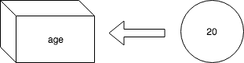

# 3章 基本文法
この章ではPythonの基本文法について学習します。

## コメント
コメントはプログラムとして評価されない文章で、ソースコードの説明などに使用します。
Pythonでコメントをつけるときは`#`を使用します。2章で作成した`hello.py`にコメントをつけてみましょう。

```python
# greeting
print("Hello Wolrd!")
```

ファイルを作成したら実行します。

```
% python sources/03/hello.py
Hello World!
```

出力結果に何も変化がないことがわかると思います。


また、複数行のコメントを描きたい場合は、`'''`で囲みます。

```python
'''
greeting
to You
'''
print("Hello World!")
```

コメント機能は開発者がソースコード上で取れる数少ないコミュニケーションの一つです。
使用上の注意点やソースの意図の説明など、効果的なコメントを残すことを心がけるようにしましょう。

## 演算子
Pythonには主に以下の演算子があります。

- 算術演算子
- 比較演算子
- 論理演算子

### 算術演算子
算術演算子は計算をするための記号です。

|演算子|説明|
|-|-|
|+|加算、文字列結合|
|-|減算|
|*|乗算|
|/|浮動小数点の除算|
|//|整数の除算（切り捨て）|
|%|剰余算|
|**|指数|

実際に計算してみましょう。

```python
print(2 + 3)  # 5
print(3 - 2)  # 1
print(3 * 2)  # 6
print(3 / 2)  # 1.5
print(3 // 2) # 1
print(3 % 2)  # 1
print(3 ** 2) # 9
print("Hello" + " World!")  # Hello World!
```

Pythonで算術演算子を扱う場合、ひとつ注意点があります。
+演算子を使って、**数値と文字列の結合はできない** ということです。
他の言語では可能である場合もあるので注意しましょう。

```python
# エラーが発生する
# print("1 + 1 = " + 1 + 1)

# 数値を文字列に変換した上で、文字列結合する
print("1 + 1 = " + str(1 + 1))
```
> Pythonには、インクリメント、デクリメント演算子もありませんので、注意してください。

### 比較演算子
比較演算子は比較をするための記号です。比較結果は論理値で返されます。
> 論理値とは真偽を表す値で、TrueまたはFalseが定められています。

|演算子|説明|
|-|-|
|<|小なり|
|>|大なり|
|<=|以下|
|>=|以上|
|==|等しい|
|!=|等しくない|

実際に比較してみましょう。

```python
print(3 < 2)  # False
print(3 > 2)  # True
print(3 <= 2) # False
print(3 >= 2) # True
print(2 == 2) # True
print(3 != 2) # True
print("Hello" == "Hello") # True
```

Pythonでは異なる型の値の比較はFalseになります。

```python
print(1 == '1')  # False
```

<div style="page-break-before:always"></div>

### 論理演算子
論理演算子は、真偽を組み合わせた結果を論理値で返します。

|演算子|説明|
|-|-|
|and|かつ|
|or|または|
|not|否定|

```python
print(True and True)  # True
print(True and False) # False
print(True or True)   # True
print(True or False)  # True
print(not True)       # False
print(not False)      # True
```

論理演算子は多くの場合、比較演算子と組み合わせて使用されます。

```python
print(3 > 2 and 4 > 5)  # False
```

## 変数
変数とは、プログラムで扱われるデータを一定期間記憶し、必要なときに利用可能にするデータ格納場所に名前をつけたものです。[変数名 = 値]という書き方で値を代入します。

```python
# 変数名 = 値
age = 20
```

`age`という名前の箱に20という値を代入したとイメージするとわかりやすいと思います。



変数を使用する時は、変数名をそのまま指定します。

```python
age = 20

print(age)  # 20
```

## 予約語
予約語とは、プログラミング言語の仕様で意味が定められ、変数名や関数名として利用できない単語のことです。
Pythonでは以下の予約語があります。

```
False, None, True, and, as, assert, break, class, continue, def, del, elif, else, except, finally,
for, from, global, if, import, in, is, lambda, nonlocal, not, or, pass, raise, return, try, while,
with, yield など
```

例えば以下のようにするとエラーとなります。

```python
and = 10

print(and)
```
