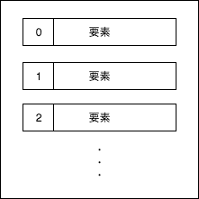

# 4章 データ型
この章ではPythonのデータ型について学習します。

## データ型の種類
`1`や`"Hello World!"`というようなデータには型があります。
例えば'1'は整数型、"Hello World!"は文字列型です。
全体像としては以下の図のようになっています。


文字列と数値は結合できなかったりと、データ型を意識しながらプログラミングしていくことはとても大切になっていきます。

## 数値型
数値型は以下の3種類に分けることができます。

- 整数型（int）
- 論理型（boolean）
- 浮動小数点型（float）

> 複素数は当テキストでは扱いません。

### 整数型（int)
整数型は離散数値を表します。

```python
i1 = 10
i2 = -4

print(type(i1)) # <class 'int'>
print(type(i2)) # <class 'int'>
```

<div style="page-break-before:always"></div>

### 論理型（boolean）
論理型は真偽値（True or False）のことです。
Pythonでは数値を真偽値と同じ物として扱います。

```python
print(0 == False)   # True
print(1 == True)    # True
print(2 == True)    # False
```

他言語とは仕様が異なる場合があるので注意しましょう。

### 浮動小数点型（float）
浮動小数点型は小数値を表します。

```python
f1 = 0.5
f2 = - 1 / 3

print(type(f1)) # <class 'float'>
print(type(f2)) # <class 'float'>
```

#### 丸め誤差について
コンピュータでは`0.3333...`のような循環小数や、とても小さい数を正確に扱うことができません。そういう値を扱う場合は、**近似値** を使用します。そのため、小さい小数値を扱う場合、計算結果に誤差が生じる可能性があることを留意しておいてください。

```python
f1 = 10 / 3

print(f1)   # 3.3333333333333335
```

<div style="page-break-before:always"></div>

## 文字列型（str）
文字列型を扱うには`"（ダブルクォーテーション）`または、`'（シングルクォーテーション）`で囲みます。

```python
first_name = "Taro"
last_name = 'Sato'

print(type(first_name)) # <class 'str'>
print(type(last_name))  # <class 'str'>
```

他の言語ではダブルクォーテーションとシングルクォーテーションを区別することもありますが、Pythonでは同一に扱います。

基本的にはプログラム内で統一すると良いでしょう。
ただし、文字列内でダブルクォーテーションを使いたい、または、シングルクォーテーションを使いたい場合は、別のほうを使用することで上手に処理することができます。

```python
# 以下のように書くと文字列の終了が正常に機能しない。
message = 'Hello, 'Python'.'

# ダブルクォーテーションを使用することで、対応できる。
message = "Hello, 'Python'."
```

### エスケープシーケンス
`/（バックスラッシュ）`を使用することで、文字の意味を消去することができます。

```python
message = 'Hello, \'Python\'.'
print(message) # Hello, 'Python'.
```
シングルクォーテーションの前にバックスラッシュをつけることで、シングルクォーテーションは意味を失い、ただの文字列として扱うことができました。
> Windowsの場合はバックスラッシュではなく、¥を使用します。

## None型
None型は少し特殊で、オブジェクトが存在しないことを意味します。

```python
n = None

print(n)       # None
print(type(n)) # <class 'NoneType'>
```
> 他言語では多くの場合、nullと表現されます。

<div style="page-break-before:always"></div>

## リスト
リストは複数の要素から構成され、順番に値を保持しています。



以下のような特徴があります。

- どのような型でも格納できる
- 異なる型でも同時に格納できる
- 可変長である
- 重複を許可する

### リストの作成
リストを作成する場合は、`[]`を使用します。

```python
# リストの作成
points = [80, 75, 90, 100]

# 空のリストの作成
empty = []

print(points) # [80, 75, 90, 100]
```

### リストの参照
リストの一つ一つの要素を参照するには、以下のようにインデックス番号を指定します。

```python
points = [80, 75, 90, 100]

print(points[0])  # 80
print(points[1])  # 75
print(points[-1]) # 100
```
リストのインデックスは0から始まることに注意してください。

<div style="page-break-before:always"></div>

### リストのスライス
リストの一部のみを切り出して別のリストを作成することができます。
`[開始:終了:増分]`という指定をします。

```python
points = [80, 75, 90, 100]

# 0から2までの値を1つおきに
print(points[0:2:1])  # [80, 75]

# 省略することもできます
print(points[:2:])  # [80, 75]

# 先頭から末尾まで2つおきに
print(points[::2])  # [80, 90]
```

### 要素の存在チェック
リストの要素に指定の値が存在するか調べることができます。
`値 in リスト`という構文を使用します。

```python
points = [80, 75, 90, 100]

exist10 = 10 in points
exist75 = 75 in points

print(exist10)  # False
print(exist75)  # True
```

### リストの要素数
リストの長さ（要素数）を取得することができます。
len関数を使用します。

```python
points = [80, 75, 90, 100]

print(len(points))  # 4
```

### リストの最大値と最小値
リスト要素中の最大値を取得するには、max関数を使用します。

```python
points = [80, 75, 90, 100]

print(max(points))  # 100
```

リスト要素中の最小値を取得するには、min関数を使用します。

```python
points = [80, 75, 90, 100]

print(min(points))  # 75
```

<div style="page-break-before:always"></div>

### リストのソート
リストの要素の順番を並び替えることができます。
sorted関数を使用します。

```python
points = [80, 75, 90, 100]

print(sorted(points)) # [75, 80, 90, 100]

# 引数にreverse=Trueを指定すると降順になる
print(sorted(points, reverse=True)) # [100, 90, 80, 75]
```

### 要素の更新
リストの既存の要素を更新することができます。
リストのインデックスで指定し、値を代入することで更新します。

```python
points = [80, 75, 90, 100]

points[1] = 65

print(points)  # [80, 65, 90, 100]
```

### 要素の追加と削除
リストに要素を追加するには、appendメソッドを使用します。

```python
points = [80, 75, 90, 100]

points.append("new element")

print(points) # [80, 75, 90, 100, 'new element']

```

appendメソッドは末尾に要素を追加しますが、間に挿入することもできます。その場合は、insertメソッドを使用します。

```python
points = [80, 75, 90, 100]

# 第一引数：要素番号
# 第二引数：値
points.insert(2, "new element")

print(points) # [80, 75, 'new element', 90, 100]
```

リストの要素を削除するにはremoveメソッド、またはdel文を使用します。

```python
points = [80, 75, 90, 100]

points.remove(75)

print(points) # [80, 90, 100]

del points[1]

print(points) # [80, 100]
```

<div style="page-break-before:always"></div>

## タプル
タプルは複数の要素から構成され、順番に値を保持しています。
リストとほぼ同様の機能を有しています。


以下のような特徴があります。

- どのような型でも格納できる
- 異なる型でも同時に格納できる
- 重複を許可する
- **要素の追加、変更、削除ができない**

変更の必要がないようなデータはタプルで扱うのが好ましいでしょう。

### タプルの作成
タプルを作成する場合は`()`を使用します。

```python
# タプルの作成
points = (80, 75, 90, 100)

print(points) # (80, 75, 90, 100)

# 削除しようとするとエラーとなる
# points.remove(75)
```

### タプルの参照
タプルの一つ一つの要素を参照するには、リストと同じようにインデックス番号を指定します。

```python
points = (80, 75, 90, 100)

print(points[0])  # 80
print(points[1])  # 75
print(points[-1]) # 100
```

<div style="page-break-before:always"></div>

### タプルとリスト相互作成
タプルからリストを新しく作り出すことができます。
その場合は、list関数を使用します。

```python
points = (80, 75, 90, 100)

points_list = list(points)

print(points_list)  # [80, 75, 90, 100]
print(type(points_list))  # <class 'list'>
```

逆にリストからタプルを新しく作り出すこともできます。
その場合は、tuple関数を使用します。

```python
points = [80, 75, 90, 100]

points_tuple = tuple(points)

print(points_tuple)  # (80, 75, 90, 100)
print(type(points_tuple))  # <class 'tuple'>
```

<div style="page-break-before:always"></div>

## セット
セットは複数のユニークな要素から構成され、順番は保持しません。
リストとほぼ同様の機能を有しています。


以下のような特徴があります。

- どのような型でも格納できる
- 異なる型でも同時に格納できる
- 可変長である
- **重複を許可しない**
- **順番を保証しない**

### セットの作成
セットを作成する場合は、`{}`を使用します。

```python
# セットの作成
points = {80, 75, 90, 100}

# 空のセット {}では空のディクショナリになる
empty = set()

# 順番が作成時と異なる
print(points)  # {80, 90, 75, 100}
```

### セットの参照
順番を保持していないため、リストやタプルのようにインデックスを利用した個別参照はできません。
セットの値を参照したい場合はfor文を使用して全要素を取得する必要があります。

```python
points = {80, 75, 90, 100}

for point in points :
  print(point)

# 80
# 90
# 75
# 100
```
> for文については次章にて詳しく解説します。

<div style="page-break-before:always"></div>

### セットの追加と削除
セットの追加をする場合は、addメソッドを使用します。

```python
points = {80, 75, 90, 100}

points.add("new element")
# 重複する値を追加しても無視される
points.add(80)

print(points) # {100, 75, 'new element', 80, 90}
```

セットを削除する場合は、removeメソッドを使用します。

```python
points = {80, 75, 90, 100}

points.remove(75)

print(points) # {100, 80, 90}
```

<div style="page-break-before:always"></div>

## ディクショナリ
ディクショナリは複数の値とキーを組み合わせた要素から構成され、順番は保証されません。


以下のような特徴があります。

- どのような型でも格納できる
- 異なる型でも同時に格納できる
- 可変長である
- **キーは重複を許可しない**
- **順番を保証しない**

### ディクショナリの作成
ディクショナリを作成する場合は、`{key:value}`を使用します。

```python
# ディクショナリの作成
points = {"math" : 80,
          "english" : 75,
          "science" : 90,
          "history" : 100}

print(points) # {'math': 80, 'english': 75, 'science': 90, 'history': 100}
```

### ディクショナリの参照
ディクショナリの要素を参照する場合は、キーを指定します。

```python
points = {"math" : 80,
          "english" : 75,
          "science" : 90,
          "history" : 100}

print(points["math"])    # 80
print(points["history"]) # 100

# 存在しないキーを参照しようとするとエラーとなる
# print(points["geographic"])
```

他にもgetメソッドを使用する方法があります。

```python
points = {"math" : 80,
          "english" : 75,
          "science" : 90,
          "history" : 100}

print(points.get("english"))       # 75
# 取得できない場合はNoneとなる
print(points.get("geographic"))    # None
# 第二引数に値を設定することで、存在しない場合にその値を返す
print(points.get("geographic", 0)) # 0
```
また、キーの一覧や、値の一覧を取得することもできます。

```python
points = {"math" : 80,
          "english" : 75,
          "science" : 90,
          "history" : 100}

keys = points.keys()
values = points.values()

print(keys)     # dict_keys(['math', 'english', 'science', 'history'])
print(values)   # dict_values([80, 75, 90, 100])
```

キーと値をタプル形式で取得したい場合は、itemsメソッドを使用します。

```python
points = {"math" : 80,
          "english" : 75,
          "science" : 90,
          "history" : 100}

items = points.items()

print(items)  # dict_items([('math', 80), ('english', 75), ('science', 90), ('history', 100)])
```

### 要素の更新
ディクショナリの要素を更新する場合は、キーを指定し、新しい要素を代入します。

```python
points = {"math" : 80,
          "english" : 75,
          "science" : 90,
          "history" : 100}

points["math"] = 95

print(points)  # {'math': 95, 'english': 75, 'science': 90, 'history': 100}
```

<div style="page-break-before:always"></div>

### 要素の追加と削除
ディクショナリの要素を追加する場合は、新しいキーを指定し、要素を代入します。

```python
points = {"math" : 80,
          "english" : 75,
          "science" : 90,
          "history" : 100}

points["geographic"] = 95

print(points)  # {'math': 80, 'english': 75, 'science': 90, 'history': 100, 'geographic': 95}
```

ディクショナリの要素を削除する場合は、del文を使用します。

```python
points = {"math" : 80,
          "english" : 75,
          "science" : 90,
          "history" : 100}

del points["english"]

print(points)  # {'math': 80, 'science': 90, 'history': 100, 'geographic': 95}
```
