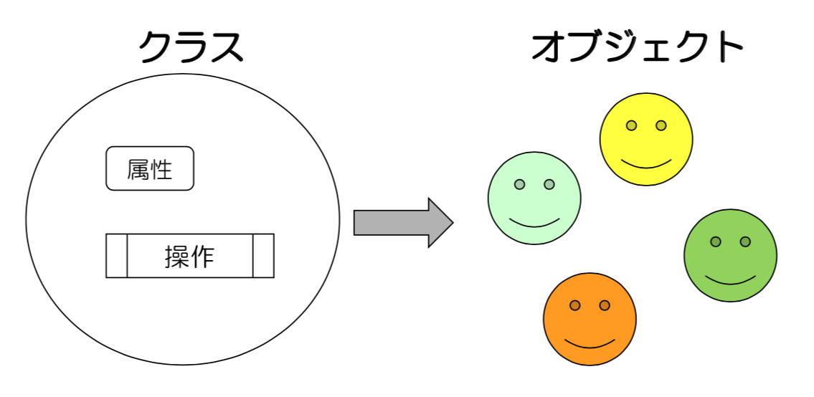
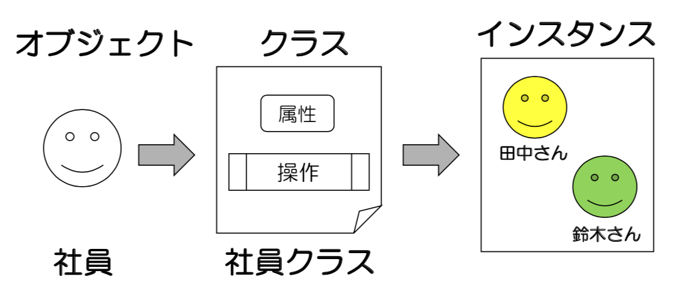

# 7章 クラス
この章ではクラスについて学習します。

## クラスとは
クラスとは、属性（データ）とその操作（メソッド）をまとめたオブジェクトの雛形を定義したものです。



クラスを利用するには以下の手順が必要です。

1. クラスとクラスのメンバ（属性と操作）を定義する  
2. インスタンスを生成する  
3. クラスのメンバを利用する  



<div style="page-break-before:always"></div>

### 1.クラスとクラスのメンバを定義する
ここではユーザー情報を扱いたいとしましょう。
クラスを作成するには`class`を使用します。

```python
class User:
  pass
```

#### コンストラクタ
クラスにメンバを定義する前に、コンストラクタと呼ばれる特殊なメソッドする必要があります。
コンストラクタは名前が決まっており、`__init__(self)`です。

```python
class User:
  def __init__(self):
    pass
```

コンストラクタはクラスをインスタンス化した時に呼ばれる、メソッドです。
主にインスタンスの初期化のために利用されます。

#### 属性の追加
クラスに属性を追加する場合は、`self.属性名`を定義します。
ユーザーに必要な属性は、姓、名、年齢としましょう。

```python
class User:
  def __init__(self, last_name, first_name, age):
    self.last_name = last_name
    self.first_name = first_name
    self.age = age
```

> selfについて
Pythonではインスタンスメソッドを定義する時に、引数に必ずselfを記述するというルールがあります。
selfは自分自身のオブジェクトを意味します。

#### 操作の追加
クラスに操作を追加する場合は、クラス内にメソッドを定義します。
ここではユーザーのフルネームを取得するメソッドを定義してみましょう。

```python
class User:
  def __init__(self, last_name, first_name, age):
    self.last_name = last_name
    self.first_name = first_name
    self.age = age

  def get_full_name(self):
    return self.last_name + " " + self.first_name
```
これでユーザークラスを定義できました。

<div style="page-break-before:always"></div>

### 2.インスタンスを生成する
クラスを定義したら次にインスタンスを生成する必要があります。
インスタンスの生成は以下のようにします。

```python
user = User("Tanaka", "Taro", 20)
```

Userの引数はコンストラクタの引数に受け渡されます。その際、selfには自動的にインスタンス自身が代入され、それより後の引数に代入されます。
print関数を使用して、確認してみましょう。

```python
# クラス定義
class User:
  def __init__(self, last_name, first_name, age):
    print(self)         # <__main__.User object at 0x10482ee80>
    print(first_name)   # Tanaka
    print(last_name)    # Taro
    print(age)          # 20
    self.last_name = last_name
    self.first_name = first_name
    self.age = age

  def get_full_name(self):
    return self.last_name + " " + self.first_name

# インスタンス化
user = User("Tanaka", "Taro", 20)
```

### 3.クラスのメンバを利用する
最後にクラスのメンバを利用してみましょう。
メンバを利用するには`インスタンス.メンバ`で指定します。

```python
# クラス定義
class User:
  def __init__(self, last_name, first_name, age):
    self.last_name = last_name
    self.first_name = first_name
    self.age = age

  def get_full_name(self):
    return self.last_name + " " + self.first_name

# インスタンス化
user1 = User("Tanaka", "Taro", 20)

# メンバの利用
print(user1.first_name)      # Tanaka
print(user1.last_name)       # Taro
print(user1.age)             # 20
print(user1.get_full_name()) # Tanaka Taro

# いくつでもインスタンス化できる
user2 = User("Suzuki", "Hanako", 21)

print(user2.first_name)      # Suzuki
print(user2.last_name)       # Hanako
print(user2.age)             # 21
print(user2.get_full_name()) # Suzuki Hanako
```

<div style="page-break-before:always"></div>

## クラスの役割
クラスの役割は属性と操作を分類する（Classify）ことです。
クラスにはどういうメリットがあるのか、クラスを利用する場合と利用しない場合で比べてみましょう。
まず、クラスを利用しない場合の例をみてみましょう。
ユーザー情報を画面に出力するプログラムを考えます。

```python
def get_full_name(last_name, first_name):
  return last_name + " " + first_name

def show_two_users(user1_first_name, user1_last_name, user1_age,
                   user2_first_name, user2_last_name, user2_age):
  print("Name : ", get_full_name(user1_last_name, user1_first_name))
  print("Age : ", user1_age)
  print("Name : ", get_full_name(user2_last_name, user2_first_name))
  print("Age : ", user2_age)


user1_first_name = "Taro"
user1_last_name = "Tanaka"
user1_age = 20

user2_first_name = "Hanako"
user2_last_name = "Suzuki"
user2_age = 21

show_two_users(user1_first_name, user1_last_name, user1_age,
               user2_first_name, user2_last_name, user2_age)
```

引数や関数が多くて非常に煩雑な様子がわかると思います。
Userクラスを利用してこれを整理してみましょう。

```python
# クラス定義
class User:
  def __init__(self, last_name, first_name, age):
    self.last_name = last_name
    self.first_name = first_name
    self.age = age

  def get_full_name(self):
    return self.last_name + " " + self.first_name


def show_two_users(user1, user2):
  print("Name : ", user1.get_full_name())
  print("Age : ", user1.age)
  print("Name : ", user2.get_full_name())
  print("Age : ", user2.age)

# インスタンス化
user1 = User("Tanaka", "Taro", 20)
user2 = User("Suzuki", "Hanako", 21)

show_two_users(user1, user2)
```

クラスのおかげで、ユーザーの情報をまとめて一つとして扱えるようになりました。
それにより、引数も減り、かなり簡潔になったのではないでしょうか。
情報量が多ければ多いほどクラスの効果は大きくなります。
実際のプログラムではUserクラスを別ファイルに記述するのが一般的です。
そうすることで更に簡潔にプログラミングできるようになるでしょう。

<div style="page-break-before:always"></div>

## クラス属性
今まで学習してきた属性はインスタンスに紐づいており、インスタンスを生成しないと使用できませんでした。
クラス属性を定義することでインスタンスに依存しない属性をクラスに持たせることができます。

```python
class User:

  # クラス属性
  count = 0

  def __init__(self, last_name, first_name, age):
    self.last_name = last_name
    self.first_name = first_name
    self.age = age
    __class__.count += 1

  def get_full_name(self):
    return self.last_name + " " + self.first_name

# インスタンスを生成せずに利用できる
print(User.count) # 0

user1 = User("Tanaka", "Taro", 20)
user2 = User("Suzuki", "Hanako", 21)

print(User.count) # 2
```

## クラスメソッド
クラスメソッドはインスタンスに依存しないメソッドです。
`@classmethod`を使用して定義します。

```python
class User:

  # クラス属性
  count = 0

  def __init__(self, last_name, first_name, age):
    self.last_name = last_name
    self.first_name = first_name
    self.age = age
    __class__.count += 1

  def get_full_name(self):
    return self.last_name + " " + self.first_name

  # クラスメソッド
  @classmethod
  def get_count(cls):
    print("Number of user is ", cls.count)

# インスタンスを生成せずに利用できる
User.get_count()  # Number of user is  0

user1 = User("Tanaka", "Taro", 20)
user2 = User("Suzuki", "Hanako", 21)

User.get_count()  # Number of user is  2
```

インスタンスメソッドの引数にselfを指定するのと同じように、クラスメソッドの引数にはclsを指定します。clsにはクラスの情報が代入されます。

## スタティックメソッド
スタティックメソッドはクラスメソッドと同様にインスタンスに依存しないメソッドです。
ただしスタティックメソッドは、引数にクラスの情報が代入されません。
そのためクラスにも依存しないメソッド、関数に近いものと考えてよいでしょう。

```python
class Math:
  @staticmethod
  def add(x, y):
    return x + y

  @staticmethod
  def multi(x, y):
    return x * y

# (2 + 3) * 5
print(Math.multi(Math.add(2, 3), 5))
```

<div style="page-break-before:always"></div>

## 継承
継承の仕組みを利用することで、既存のクラスを拡張したクラスを定義することができます。
継承を利用するには`class クラス名(継承元クラス)`とします。
ユーザークラスを継承した社社員クラスを定義してみましょう。
社員クラスはユーザー情報の他に社員番号（EMPNO）を持つとします。

```python
class User:
  def __init__(self, last_name, first_name, age):
    self.last_name = last_name
    self.first_name = first_name
    self.age = age

  def get_full_name(self):
    return self.last_name + " " + self.first_name

class Employee(User):
  def __init__(self, empno, first_name, last_name, age):
    self.empno = empno
    # 親のコンストラクタ呼び出し
    super().__init__(first_name, last_name, age)

  def work(self):
    print(self.get_full_name + " working...")
```

継承元のクラス（User）を親クラスやスーパークラスと呼び、継承先のクラス（Employee）を子クラスやサブクラスと呼びます。
子クラスでは、親のインスタンスを参照したい場合は、superメソッドを使用します。
子クラスは親クラスの属性と操作を継承します。

```python
class User:
  def __init__(self, last_name, first_name, age):
    self.last_name = last_name
    self.first_name = first_name
    self.age = age

  def get_full_name(self):
    return self.last_name + " " + self.first_name

class Employee(User):
  def __init__(self, empno, first_name, last_name, age):
    self.empno = empno
    # 親のコンストラクタ呼び出し
    super().__init__(first_name, last_name, age)

  def work(self):
    print(self.get_full_name() + " working...")

emp = Employee("001", "Tanaka", "Taro", 20)

# 親クラスの属性
print(emp.last_name)    # Tanaka
print(emp.first_name)   # Taro
print(emp.age)          # 20

# 親クラスの操作
print(emp.get_full_name())  # Tanaka Taro

# 自クラスの属性
print(emp.empno)      # 001

# 自クラスの操作
emp.work()            # Tanaka Taro working...
```

<div style="page-break-before:always"></div>

## オーバーライド
親クラスで定義されたメソッドを子クラスで再定義することをオーバーライドと言います。

```python
class User:
  def __init__(self, last_name, first_name, age):
    self.last_name = last_name
    self.first_name = first_name
    self.age = age

  def get_full_name(self):
    return self.last_name + " " + self.first_name

class Employee(User):
  def __init__(self, empno, first_name, last_name, age):
    self.empno = empno
    super().__init__(first_name, last_name, age)

  def work(self):
    print(super().get_full_name() + " working...")

  def get_full_name(self):
    return "Name : " + self.last_name + " " + self.first_name

emp = Employee("001", "Tanaka", "Taro", 20)

print(emp.get_full_name())  # Name : Tanaka Taro
```

## 多重継承
多くのオブジェクト指向言語で多重継承は許可していませんが、Pythonでは多重継承を許しています。

```python
class Robot:
  def charge(self):
    print("charging...")

class Dog:
  def bark(self):
    print("barking...")

class RobotDog(Robot, Dog):
  pass

bob = RobotDog()
bob.charge()    # charging...
bob.bark()      # barking...
```
> 親クラス内に同一メソッドが存在する場合は、先に記述したクラスのメソッドが優先されます。
